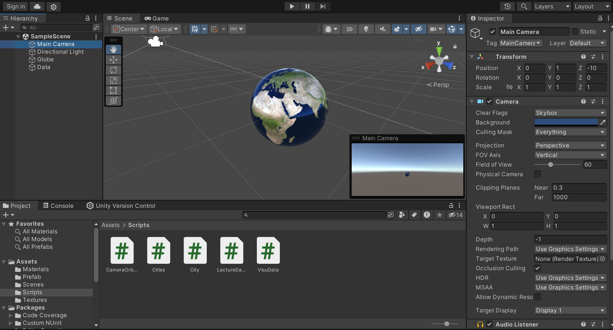

# Globe Data Visualization Project 🌎

This project is a Unity-based 3D data visualization tool that displays population data on a rotating globe. By using C# scripts, JSON parsing, and 3D asset management, this project visualizes the population of various cities by dynamically instantiating scalable cubes at geospatial locations on the globe.

## Features:
- **3D Globe Creation**: A sphere representing Earth is created and textured with day/night, normal, and specular maps for a realistic look.
- **Data Point Instantiation**: Cubes (prefabs) are instantiated dynamically on the globe to represent cities, with their size scaled according to the population.
- **Geospatial Mapping**: Latitude and longitude coordinates are converted to 3D Cartesian coordinates, ensuring accurate placement of data points on the globe.
- **JSON Integration**: Population data is read from a JSON file and visualized on the globe.
- **Orbiting Camera**: The camera orbits around the globe, allowing the user to view all data points dynamically.

## Technologies Used:
- **Unity**: Game engine for 3D graphics and visualization.
- **C#**: Scripting language for camera control, object instantiation, and data parsing.
- **JSON**: Format used to store and retrieve city population data.
- **Prefab System**: For instantiating visual elements dynamically on the globe.

## How to Run:
1. Download or clone the repository.
2. Open the project in Unity.
3. Import the required assets (textures and JSON file).
4. Press Play to view the rotating globe and the city population visualization.

## Future Improvements:
- Add user interaction for zooming and panning.
- Display city names and population on hover.
- Incorporate real-time data updates from external APIs.

## Credits:
- **Textures**: [Solar System Scope](https://www.solarsystemscope.com/textures/)
- **Data**: World Cities Population Dataset (available in the project).

